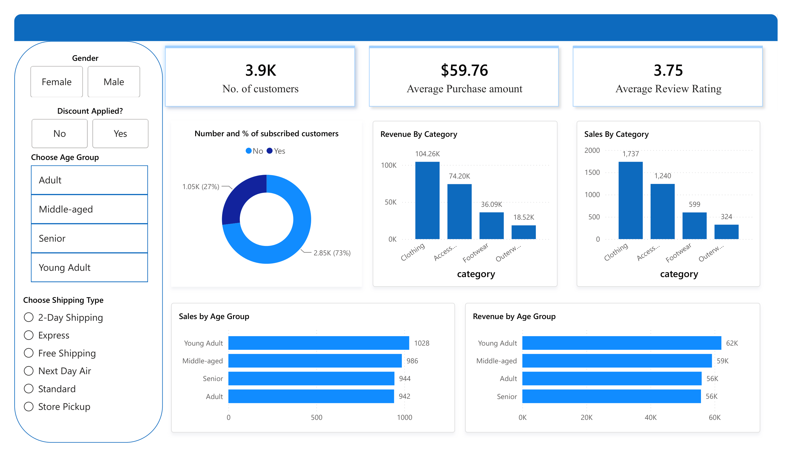

# 🛍️ Customer Behavior Analysis

An end-to-end retail analytics project examining consumer shopping trends and purchase dynamics across 3,900 customer. This project executes the complete analytics lifecycle: structured data cleaning, missing-value imputation, and feature engineering in **Python**, structured KPI extraction and cohort analysis in **MySQL**, and executive-level visualization in **Power BI** to deliver actionable insights on promotional discounting, customer loyalty, and subscription growth.

Analytics Lifecycle: Data Cleaning & Feature Engineering (Python) $\rightarrow$ Relational Schema & Metric Extraction (MySQL) $\rightarrow$ Interactive Dashboarding (Power BI)

---

### 📊 Live Interactive Dashboard
Executive dashboard tracking sales volume, demographic spending tiers, and subscriber penetration across fulfillment channels.

👉 **[View Live Power BI Report](https://app.powerbi.com/view?r=eyJrIjoiNGQwM2E4ZTAtMjY3MC00MzE3LWEzOTYtOWZlZTk4ZjA0Mzg1IiwidCI6IjM0YmQ4YmVkLTJhYzEtNDFhZS05ZjA4LTRlMGEzZjExNzA2YyJ9)**

--- 

**Core Objectives:**
- Clean and standardize raw multi-category retail transaction data.
- Quantify spending disparities across customer segments, genders, age cohorts, and fulfillment methods.
- Evaluate promotional dependency to safeguard profit margins against over-discounting.
- Build an interactive reporting dashboard enabling stakeholders to make data-backed merchandising and marketing decisions.

---

## 📊 Key Insights & Findings

* **Top Category & Demographic:** **Clothing** led in sales and gross revenue, with **Young Adults** driving the largest demographic share.
* **Loyalty as Revenue Driver:** **Loyal customers** (>5 previous purchases) generated the bulk of total revenue and showed the highest propensity to subscribe.
* **Subscription Impact:** **Subscribers** consistently demonstrated higher repeat purchase frequency and basket stability than non-subscribers.
* **Discount Dependency:** While discounts accelerated volume, specific catalog items exhibited severe price dependency, eroding product margins.
* **Fulfillment Upsell:** **Express-shipping** users recorded higher average order values (AOV) than standard delivery shoppers.

---

## 🚀 Strategic Business Recommendations
- **Transition from Blanket to Tiered Discounts:** Cap margin erosion by replacing flat site-wide discounts with threshold-triggered promotions (e.g., "$15 off orders over $75") on discount-sensitive items.
- **Monetize Loyalty via Subscriptions:** Launch targeted perks (exclusive seasonal product access, complimentary express shipping) targeted at the "Returning" customer cohort to accelerate transitions into paid subscriber tiers.
- **Focus Merchandising on Core Apparel:** Allocate primary catalog display positions to top-rated products within leading volume categories to drive baseline conversions without discount reliance.
- **Fulfillment Optimization:** Incentivize express delivery through minimum purchase tiers to lift aggregate basket sizes.

---

## 🛠️ Technical Pipeline

* **Python (Data Cleansing & Feature Prep):** Cleaned 3,900 customer records in `pandas`. Imputed 37 missing `review_rating` entries using **category medians** to avoid cross-product skew, dropped redundant `promo_code_used` (collinear with `discount_applied`), binned ages into `age_group`, and derived `purchase_frequency_days`.
* **MySQL (Metric Extraction & Window Functions):** Wrote 10 production queries utilizing `DENSE_RANK() OVER (PARTITION BY category ORDER BY sales DESC)` for category top-sellers, aggregations comparing spend across subscriber tiers and shipping methods, and conditional `CASE` statements to classify customers into **New**, **Returning**, and **Loyal** segments.
* **Power BI (Modeling & Business Intelligence):** Modeled relational schema from MySQL, built DAX measures for Revenue Contribution % and Average Order Value (AOV), and created interactive slicers to cross-filter discount-dependent products against customer demographics.

---

## 👨‍💻 Author
**Ayush Rag**

